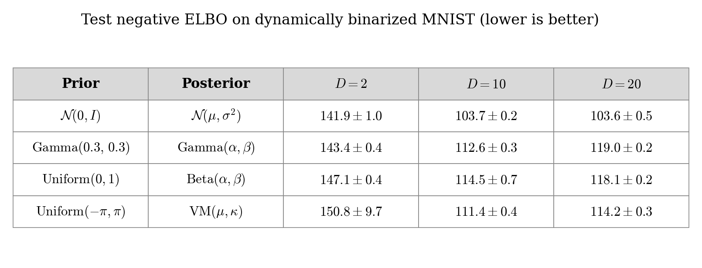
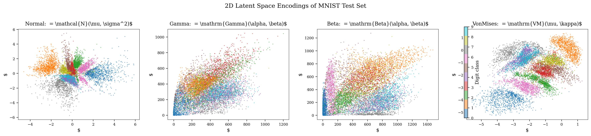
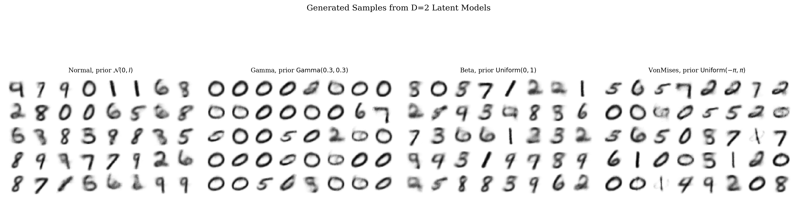

<div align="center">
    <h1>Implicit Reparameterization Trick</h1>
    <p>
        A PyTorch library for implicit reparameterization gradients
    </p>
</div>

<div align="center">
    
</div>

<p align="center">
    <a href="https://github.com/intsystems/implicit-reparameterization-trick/actions/workflows/testing.yml">
        
    </a>
    <a href="https://github.com/intsystems/implicit-reparameterization-trick/actions/workflows/docs.yml">
        
    </a>
    <a href="https://pytorch.org/">
        
    </a>
    <a href="https://opensource.org/licenses/MIT">
        
    </a>
</p>

---

| | |
|---|---|
| **Authors** | Matvei Kreinin, Maria Nikitina, Petr Babkin, Iryna Zabarianska |
| **Consultant** | Oleg Bakhteev, PhD |
| **Paper** | [Figurnov et al., *Implicit Reparameterization Gradients*, NeurIPS 2018](https://arxiv.org/abs/1805.08498) |

## Overview

This library implements implicit reparameterization gradients for continuous distributions
that lack tractable inverse CDFs. It provides drop-in replacements for `torch.distributions`
classes with full support for reparameterized sampling (`rsample`), enabling
gradient-based optimization through stochastic nodes.

The key idea from the paper: instead of inverting the CDF explicitly,
compute reparameterization gradients via implicit differentiation:

$$\nabla_\phi z = -\frac{\nabla_\phi F(z \mid \phi)}{q_\phi(z)}$$

## Implemented Distributions

| Distribution | Parameters | Method |
|---|---|---|
| `Normal` | loc, scale | Implicit standardization |
| `Gamma` | concentration, rate | Implicit CDF + scaling |
| `Beta` | concentration1, concentration0 | Via Gamma ratio |
| `Dirichlet` | concentration | Via Gamma normalization |
| `StudentT` | df, loc, scale | Via Gamma-Normal mixture |
| `VonMises` | loc, concentration | CDF series / normal approx. |
| `MixtureSameFamily` | mixture, components | Distributional transform |
| `ImplicitReparam` | any base distribution | Universal CDF wrapper (Eq. 8) |

## Installation

```bash
git clone https://github.com/intsystems/implicit-reparameterization-trick.git
cd implicit-reparameterization-trick
pip install src/
```

## Quick Start

```python
from irt.distributions import Beta, ImplicitReparam

# Reparameterized sampling from Beta distribution
alpha = torch.tensor([2.0], requires_grad=True)
beta = torch.tensor([5.0], requires_grad=True)
dist = Beta(alpha, beta)
z = dist.rsample(torch.Size([64]))  # gradients flow to alpha and beta

# Wrap any distribution with a tractable CDF
loc = torch.tensor(0.0, requires_grad=True)
dist = ImplicitReparam(torch.distributions.Laplace(loc, 1.0))
z = dist.rsample(torch.Size([64]))  # gradients flow to loc
```

## Experiments

VAE trained on dynamically binarized MNIST following the setup in Table 4 of the paper.
Architecture: FC encoder (784-256-128) and decoder (128-256-784), 30 epochs, Adam optimizer.
Full reproduction in [`code/vae_demo.ipynb`](code/vae_demo.ipynb).

### Test Negative ELBO

<div align="center">
    
</div>

### 2D Latent Spaces

<div align="center">
    
</div>

### Generated Samples (D=2)

<div align="center">
    
</div>

## References

- M. Figurnov, S. Mohamed, A. Mnih. [Implicit Reparameterization Gradients](https://arxiv.org/abs/1805.08498). NeurIPS 2018.
- [Documentation](https://intsystems.github.io/implicit-reparameterization-trick/)
- [Blog Post](blogpost/Blog_post_sketch.pdf)
