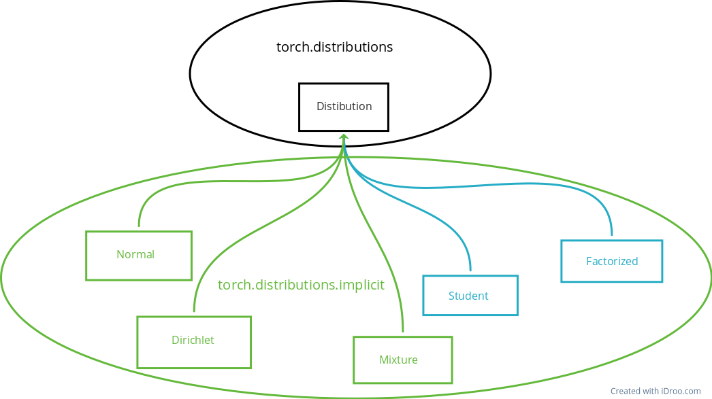

# Project plan and describtion
> [!NOTE]
> Although we have tried to make the plan final, it is possible that changes may occur.

The outcome of our __Implicit Reparametrization Trick__ project is an extension to the torch.distributions library. It will be called torch.distributions.implicit, and will contain both the distributions implemented in torch.distributions, as well as new ones that are not present there.
## Scope
We plan to implement the following distributions in our library:
- Gaussian normal distribution (*)
- Dirichlet distribution (Beta distributions)
- Sampling from a mixture of distributions
- Sampling from the Student's t-distribution (**)
- Sampling from an arbitrary factorized distribution (***)

(\*) - this distribution is already implemented in torch using the explicit reparameterization trick, we will implement it for comparison

(\*\*) - this distribution is added as a backup, their inclusion is questionable

(\*\*\*) - this distribution is not very clear in implementation, its inclusion is questionable

## Stack

We plan to inherit from the torch.distribution.Distribution class, so we need to implement all the methods that are present in that class.



On this diagram, the elements marked in black already exist. The elements marked in green are planned to be implemented. The elements marked in blue are ones whose implementation is uncertain.

## Scheme of classes and examples

In this section, we present the implementation scheme of the library, showing the classes and their methods that are planned to be implemented. Here we provide a description of the classes and the arguments they accept.
```
class torch.distributions.Distribution:
	'''
	The abstract base class for probability distributions, which we inherit from. These methods are implied
	to be implemented for each subclass.
	'''
	def __init__(batch_shape=torch.Size([]), event_shape=torch.Size([])):
		'''
		Basic constructer of distribution.
		'''
	
	@property
	def arg_constraints():
		'''
		Returns a dictionary from argument names to Constraint objects that should
		be satisfied by each argument of this distribution. Args that are not tensors need not appear
		in this dict.
		'''
	
	def cdf(value):
		'''
		Returns the cumulative density/mass function evaluated at value.
		'''
		
	def entropy():
		'''
		Returns entropy of distribution, batched over batch_shape.
		'''

	def enumerate_support(expand=True):
		'''
		Returns tensor containing all values supported by a discrete distribution. The result will
		enumerate over dimension 0, so the shape of the result will be (cardinality,) + batch_shape
		+ event_shape (where event_shape = () for univariate distributions).
		'''
	
	@property
	def mean(expand=True):
		'''
		Returns mean of the distributio.
		'''

	@property
	def mode(expand=True):
		'''
		Returns mean of the distributio.
		'''
	def perplexity():
		'''
		Returns perplexity of distribution, batched over batch_shape.
		'''
	
	def rsample(sample_shape=torch.Size([])):
		'''
		Generates a sample_shape shaped sample or sample_shape shaped batch of samples if the distribution
		parameters are batched.
		'''

	def sample(sample_shape=torch.Size([])):
		'''
		Generates a sample_shape shaped sample or sample_shape shaped batch of reparameterized samples
		if the distribution parameters are batched.
		'''

class torch.distributions.implicit.Normal(Distribution):
	'''
	A Gaussian distribution class with backpropagation capability for the rsample function through IRT.
	'''
	def __init__(mean_matrix, covariance_matrix=None):
		pass

class torch.distributions.implicit.Dirichlet(Distribution):
	'''
	A Dirichlet distribution class with backpropagation capability for the rsample function through IRT.
	'''
	def __init__(concentration, validate_args=None):
		pass
		
class torch.distributions.implicit.Mixture(Distribution):
	'''
	A Mixture of distributions class with backpropagation capability for the rsample function through IRT.
	'''
	def __init__(distributions : List[Distribution]):
		pass

class torch.distributions.implicit.student(Distribution):
	'''
	A Student's distribution class with backpropagation capability for the rsample function through IRT.
	'''
	def __init__():
		pass

class torch.distributions.implicit.factorized(Distribution):
	'''
	A class for an arbitrary factorized distribution with backpropagation capability for the rsample
	function through IRT.
	'''
```
####  Usage
In this example, we demonstrate the application of our library using a Variational Autoencoder (VAE) model, where the latent layer is modified by a normal distribution.
```
>>> import torch.distributions.implicit as irt
>>> params = Encoder(inputs)
>>> gauss = irt.Normal(*params)
>>> deviated = gauss.rsample()
>>> outputs = Decoder(deviated)
```
In this example, we demonstrate the use of a mixture of distributions using our library.
```
>>> import torch.distributions.implicit as irt
>>> params = Encoder(inputs)
>>> mix = irt.Mixture([irt.Normal(*params), irt.Dirichlet(*params)])
>>> deviated = mix.rsample()
>>> outputs = Decoder(deviated)
```


## Plan of implementation

